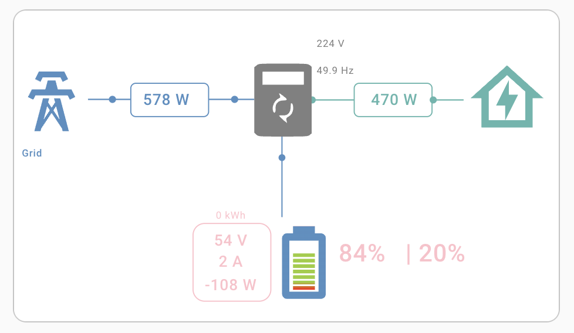
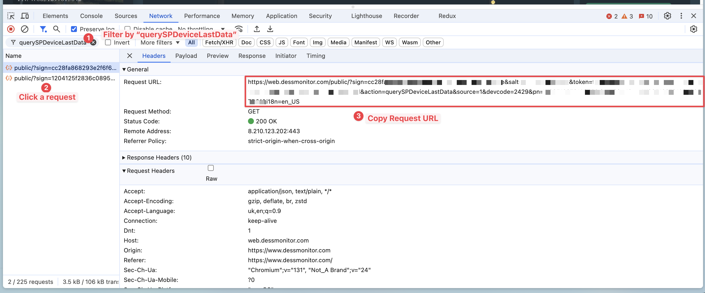

# DessMonitor / SmartESS → Home Assistant

Pull live inverter data from the [dessmonitor.com](https://dessmonitor.com) (a.k.a. **SmartESS**) cloud API
into [Home Assistant](https://www.home-assistant.io/) as native sensors, and visualize it with a power-flow card.

No add-on, no custom integration, no cloud polling limits to worry about — just a built-in REST sensor and a
template file you copy in.



## Contents

- [Will it work for my inverter?](#will-it-work-for-my-inverter)
- [Exported sensors](#exported-sensors)
- [Installation](#installation)
- [Visualize the data](#visualize-the-data)
- [Troubleshooting](#troubleshooting)
- [Contributing](#contributing)

## Will it work for my inverter?

This works for any inverter or data logger that reports to the **SmartEss** cloud
([Android](https://play.google.com/store/apps/details?id=com.eybond.smartclient.ess&hl=uk),
[iOS](https://apps.apple.com/ua/app/smartess/id1334656760?l=uk)) app. SmartEss is the recommended app for the
[WiFi Plug Pro](https://www.inverter.com/images/uploaded/solar-inverter-charger-wifi-plug-pro.pdf) data logger,
which ships built into a wide range of inverters — so the API is usually available even if your brand isn't listed
below.

**Quick test:** if you can log in at [dessmonitor.com](https://dessmonitor.com) with your SmartEss credentials and
see your inverter's data, this will work for you.

<details>
<summary><strong>Inverters confirmed working</strong> (click to expand)</summary>

- **Sorotec**:
    - Sorotec REVO VM II PRO 3.2kW/24V Wi-Fi
    - Sorotec REVO VM II PRO 3.5kW/24V Wi-Fi
    - Sorotec REVO HM 6kW/48V Wi-Fi
    - Sorotec REVO VM IV PRO-T 6kW/48V Wi-Fi
    - Sorotec REVO HMT 6kW/48V Wi-Fi
    - Sorotec REVO HES 6kW/48V Wi-Fi
    - Sorotec REVO HMT 11kW/48V Wi-Fi
- **MuscleGrid**:
    - MuscleGrid 4.2 KW
    - MuscleGrid 10.2 KW
    - MuscleGrid 6KW
    - MuscleGrid 6.2 KW True Hybrid
- **PowMr**:
    - PowMr 1000 Watt 220Vac 12Vdc
    - PowMr 1500 Watt 220Vac 24Vdc
    - PowMr 1600 Watt 220Vac 12Vdc
    - PowMr 2000 Watt 220Vac 12Vdc
    - PowMr 3000 Watt 110Vac 24Vdc
    - PowMr 3000 Watt 220Vac 24Vdc
    - PowMr 3200 Watt 110Vac 24Vdc
    - PowMr 3200 Watt 220Vac 24Vdc
    - PowMr 3500 Watt 110Vac 48Vdc
    - PowMr 3600 Watt DC 24V AC 110V
    - PowMr 4200 Watt DC 24V AC 220V
    - PowMr 5000 Watt 110Vac 48Vdc
    - PowMr 5000 Watt 48Vdc 110V240V
    - PowMr 6000 Watt 220Vac 48Vdc
    - PowMr 6200 Watt 220Vac 48Vdc
    - PowMr 6200 Watt 220Vac 48Vdc
    - PowMr 6200 Watt 220Vac 48Vdc Dual Outputs
    - PowMr 10.2 KW 220Vac 48Vdc
- **EG4®**
    - EG4® FlexBOSS21
    - EG4® 12000XP
    - EG4® 18kPV-12LV All-In-One Hybrid Inverter
    - EG4® 6000XP All-In-One Off-Grid Inverter
    - EG4® 12kPV All-In-One Hybrid Inverter
    - EG4® 3000EHV-48 All-In-One Off-Grid Inverter
- **Anenji®**
    - Anenji® 4200 Watt 24Vdc 220Vac
- **EASUN®**
    - EASUN® 3.2kW (generic)
- **Techfine®**
    - Techfine® Solar 11kW

</details>

Don't see your model? It will most likely still work — start with the Sorotec template and adjust the sensor IDs.
See [Contributing](#contributing).

## Exported sensors

The canonical [Sorotec template](src/template.yaml) exposes the sensors below. Other templates expose a similar
set; the exact list depends on what your inverter model reports.

| Name                      | Entity ID                        | Unit | Description                                                             |
|---------------------------|----------------------------------|------|-------------------------------------------------------------------------|
| Grid Voltage              | sensor.grid_voltage              | V    | Voltage of the grid                                                     |
| Grid Frequency            | sensor.grid_frequency            | Hz   | Frequency of the grid                                                   |
| Grid Power                | sensor.grid_power                | W    | Power from the grid                                                     |
| PV1 Voltage               | sensor.pv1_voltage               | V    | Voltage of the first photovoltaic panel                                 |
| PV1 Current               | sensor.pv1_current               | A    | Current of the first photovoltaic panel                                 |
| PV1 Power                 | sensor.pv1_power                 | W    | Power of the first photovoltaic panel                                   |
| Battery Voltage           | sensor.battery_voltage           | V    | Voltage of the battery                                                  |
| Battery Power             | sensor.battery_power             | W    | Power of the battery                                                    |
| Battery SOC               | sensor.battery_soc               | %    | State of charge of the battery                                          |
| Battery Discharge Current | sensor.battery_discharge_current | A    | Discharge current of the battery                                        |
| Battery Charging Current  | sensor.battery_charging_current  | A    | Charging current of the battery                                         |
| Battery Current           | sensor.battery_current           | A    | Total current of the battery (absolute value of charging + discharging) |
| Battery Current Direction | sensor.battery_current_direction |      | Direction of the battery current (1 for charging, 0 for discharging)    |
| Load Output Voltage       | sensor.load_output_voltage       | V    | Voltage of the load output                                              |
| Load Power                | sensor.load_power                | W    | Power of the load                                                       |

## Installation

### Prerequisites

- A working Home Assistant instance where you can edit `configuration.yaml`, `secrets.yaml` and add a
  `template.yaml` file (via the **File editor** / **Studio Code Server** add-on, Samba, or SSH).
- A SmartEss account that already shows your inverter's data at [dessmonitor.com](https://dessmonitor.com).

### Step 1 — Get your API request URL

1. Install the SmartEss app
   ([Android](https://play.google.com/store/apps/details?id=com.eybond.smartclient.ess&hl=uk),
   [iOS](https://apps.apple.com/ua/app/smartess/id1334656760?l=uk)), register, and
   [connect it to your inverter or data logger](https://www.youtube.com/watch?v=23u8nguNJSY).
2. Open [dessmonitor.com](https://dessmonitor.com) in a desktop browser and log in with the **same**
   credentials. Confirm you see your inverter data on the dashboard.
3. Open **Developer Tools** (`F12`) → **Network** tab, then refresh the page.
4. Filter requests by `querySPDeviceLastData`, click any matching request, and copy its full **Request URL**.

   

> **Note on the token:** the copied URL contains a `token` and `salt`. These are now long-lived — once added,
> the URL keeps working and does **not** need to be refreshed periodically. (Older versions of this guide
> required weekly updates; that is no longer the case.) If you ever do get an auth error, see
> [Troubleshooting](#troubleshooting).

### Step 2 — Store the URL in `secrets.yaml`

```yaml
dessmonitor_api_uri: https://web.dessmonitor.com/public/?sign=1c564f94e6d87558349aaa727f46711e0a890c&salt=173366847376&token=f82ea90e2a8261236cf4da6c28ac9293dc59148ff9a03a2765d8c0db5b6d&action=querySPDeviceLastData&source=1&devcode=2429&pn=W0051291612612&devaddr=1&sn=W0051291612612&i18n=en_US
```

Replace the example value with **your own** URL from Step 1.

### Step 3 — Add the REST sensor to `configuration.yaml`

```yaml
sensor:
  - platform: rest
    name: Inverter Data
    resource_template: !secret dessmonitor_api_uri
    method: GET
    json_attributes_path: "$.dat.pars"
    json_attributes:
      - gd_
      - sy_
      - pv_
      - bt_
      - bc_
    scan_interval: 120 # Update every 2 minutes
    value_template: "OK"
```

This creates `sensor.inverter_data`, holding the raw inverter values in its attributes. The template sensors in
the next step read from it. Keep `scan_interval` reasonable (≥ 60s) to avoid hammering the cloud API.

### Step 4 — Add the template sensors

Find your brand below, open the matching file, and copy its **entire contents** into a new file named
`template.yaml` in your Home Assistant config directory.

| Brand / Model       | Template file                      | Credits                                                                                    |
|---------------------|------------------------------------|--------------------------------------------------------------------------------------------|
| Sorotec, MuscleGrid | [template.yaml](src/template.yaml) |                                                                                            |
| PowMr               | [powmr.yaml](src/powmr.yaml)       | @lawyerhome @ [issue #1](https://github.com/SilverFire/dessmonitor-homeassistant/issues/1) |
| EG4®                | [eg4.yaml](src/eg4.yaml)           | @Joannou1 @ [issue #3](https://github.com/SilverFire/dessmonitor-homeassistant/issues/3)   |
| Anenji®             | [anenji.yaml](src/anenji.yaml)     | @itgenmar @ [issue #22](https://github.com/SilverFire/dessmonitor-homeassistant/issues/22) |
| EASUN® (generic)    | [easun.yaml](src/easun.yaml)       | @josgirrui @ [PR #19](https://github.com/SilverFire/dessmonitor-homeassistant/pull/19)     |
| Techfine®           | [techfine.yaml](src/techfine.yaml) | @IgChroma @ [PR #18](https://github.com/SilverFire/dessmonitor-homeassistant/pull/18)      |
| Other               | Start with [template.yaml](src/template.yaml) and adjust the sensor IDs — see [Contributing](#contributing). | |

### Step 5 — Include `template.yaml` from `configuration.yaml`

```yaml
template: !include template.yaml
```

If you already have a `template:` key, merge the include accordingly.

### Step 6 — Restart Home Assistant

Restart to apply the changes. Once back up, check **Developer Tools → States** for `sensor.grid_voltage`,
`sensor.battery_soc`, etc.

## Visualize the data

Any dashboard card works. The screenshot at the top uses the excellent
[sunsynk-power-flow-card](https://github.com/slipx06/sunsynk-power-flow-card). Sample config — adjust to taste:

```yaml
type: custom:sunsynk-power-flow-card
cardstyle: lite
show_solar: false
battery:
  shutdown_soc: 20
  show_daily: false
  hide_soc: false
  auto_scale: false
  show_absolute: false
  animate: true
  linear_gradient: true
  invert_power: false
  soc_end_of_charge: 90
  show_remaining_energy: false
solar:
  show_daily: false
  mppts: 0
load:
  show_daily: false
  dynamic_colour: false
grid:
  show_daily_buy: false
  show_daily_sell: false
  show_nonessential: false
  show_absolute: false
entities:
  use_timer_248: none
  inverter_voltage_154: sensor.load_output_voltage
  inverter_power_175: sensor.load_power
  inverter_status_59: sensor.sunsynk_overall_state
  day_battery_charge_70: none
  day_battery_discharge_71: none
  battery_voltage_183: sensor.battery_voltage
  battery_soc_184: sensor.battery_soc
  battery_power_190: sensor.battery_power
  day_grid_import_76: none
  day_grid_export_77: none
  grid_ct_power_172: sensor.grid_power
  day_load_energy_84: none
  essential_power: none
  day_pv_energy_108: none
  pv1_power_186: none
  pv2_power_187: none
  pv1_voltage_109: none
  pv1_current_110: none
  pv2_voltage_111: none
  pv2_current_112: none
  grid_voltage: sensor.grid_voltage
  battery_current_191: sensor.battery_current
  battery_current_direction: sensor.battery_current_direction
show_grid: true
show_battery: true
large_font: true
inverter:
  model: sunsynk
  modern: true
  auto_scale: true
  autarky: "no"
title: ""
title_size: "1"
```

## Troubleshooting

**`sensor.inverter_data` is `OK` but the template sensors are missing or `unknown`.**
The template file must be a YAML list — it has to start with `- sensor:` (note the leading `- `). If you only see
`sensor.inverter_data`, double-check you copied the file's full contents and that `template: !include template.yaml`
is present. Then restart Home Assistant.

**`{"err":10,"desc":"ERR_NO_AUTH"}` or similar auth error.**
Re-do [Step 1](#step-1--get-your-api-request-url) to grab a fresh URL and update `secrets.yaml`. Make sure you copy
the **complete** URL (it's long) and that the DessMonitor web dashboard still shows your data. With the current
long-lived token this should be rare; if it keeps happening, open an
[issue](https://github.com/SilverFire/dessmonitor-homeassistant/issues) with your inverter model, the full error
response, and when it last worked.

**Some sensors are wrong or missing for my model.**
Inverter models report different raw field IDs. Compare your inverter's attributes under
**Developer Tools → States → `sensor.inverter_data`** with the IDs used in your template and adjust the
`selectattr('id', 'equalto', ...)` values. Contributions welcome.

## Contributing

If your inverter isn't listed or a template needs tweaks:

1. Inspect `sensor.inverter_data`'s attributes in **Developer Tools → States** to find the raw field IDs your
   model reports.
2. Adapt the [Sorotec template](src/template.yaml) (or the closest one) to those IDs.
3. Open an [issue](https://github.com/SilverFire/dessmonitor-homeassistant/issues) or a pull request to share it
   with other enthusiasts 🙌
